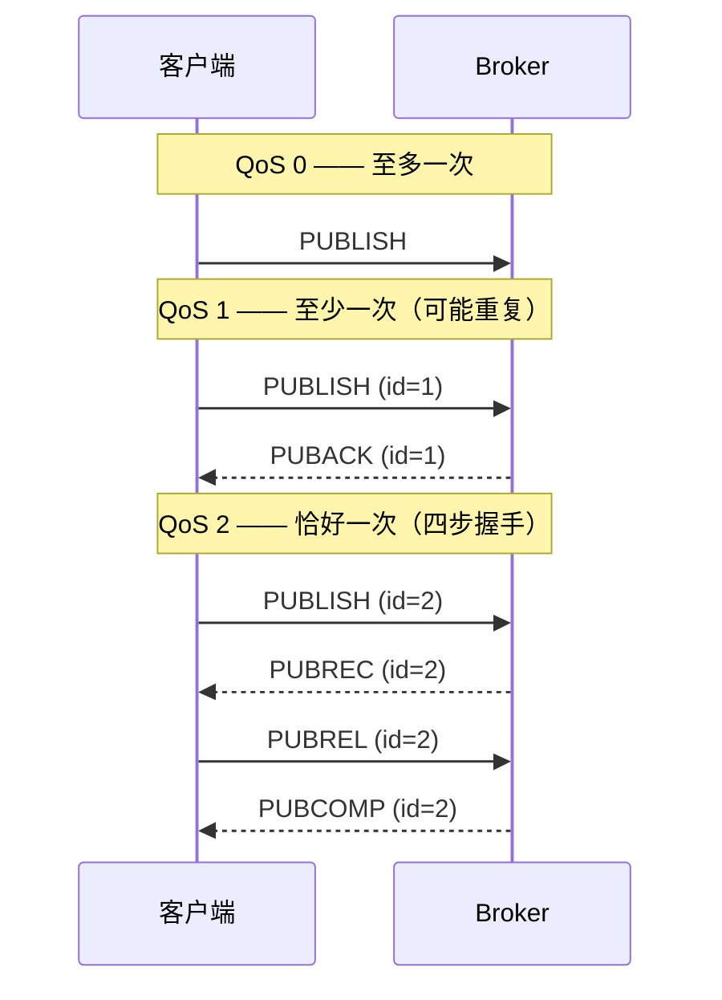

假设你给一台传感器写联网代码。最直觉的做法：设备每隔一秒问服务器一次"有新指令吗？"——HTTP 轮询，简单直接。一天下来，86400 次询问，86300 次得到的回答是"没有"。往少了算，一来一回 500 字节，一天就是约 43 MB 流量，其中真正的数据可能不到 2 KB。在 WiFi 环境里你顶多觉得浪费；但如果这台设备在沙漠里，通过按字节计费的卫星链路上报油压——多说的每一个"没有吗"都是真金白银。

1999 年，IBM 的 Andy Stanford-Clark 和 Arcom 公司的 Arlen Nipper 就面对着这样的场景：远程监测一条穿越沙漠的原油管道，现场设备靠电池供电，靠卫星通信，链路慢、贵、还爱掉线。他们的解法成了 MQTT（名字来自 MQ Telemetry Transport，"MQ 遥测传输"）。这篇文章分三层把它拆开：先用 5 分钟跑起来一个消息邮局，再打开报文看它的内部长什么样，最后想明白——为什么这个几乎"简陋"的协议，成了物联网的事实标准。

<!--more-->

## L1：先让它跑起来——两个终端，一个邮局

你在第一层。目标：本地跑一个 MQTT broker（就是那台"邮局"），亲手发一条、收一条消息，对主题（topic）长什么样有个手感。

用最常见的开源实现 mosquitto：

```sh
# 安装（Linux：apt install mosquitto mosquitto-clients；macOS：brew install mosquitto）
# 安装后 mosquitto 通常已作为服务在本地 1883 端口运行
```

然后开两个终端。终端 1 先"订阅"一个主题——`+` 是单层通配符，一会儿解释：

```sh
# 终端 1：订阅所有房间的温度
mosquitto_sub -t 'home/room/+/temperature' -v
```

```sh
# 终端 2：向一个具体主题发消息
mosquitto_pub -t 'home/room/1/temperature' -m '23.5'
```

终端 1 立刻打印出：

```
home/room/1/temperature 23.5
```

注意刚刚发生了什么：**发送方不知道接收方是谁，接收方也不知道发送方是谁**，两边只认识各自的字符串。`mosquitto_pub` 甚至不知道此刻有没有人在线——broker 收下消息，看一眼主题，投递给所有订阅了匹配主题的客户端。这就叫发布/订阅（pub/sub）模型。

主题是用 `/` 分层的字符串，靠两个通配符订阅（注意：**只有订阅能用通配符，发布不能用**）：

- `+` 匹配**恰好一层**：`home/room/+/temperature` 能匹配 `home/room/1/temperature`，但不能匹配 `home/room/1/ac/temperature`（那是四层）；
- `#` 匹配**任意多层**（只能放在末尾）：`home/#` 能匹配 `home/room/1/temperature`，也能匹配 `home/room/1/ac/temperature`。

先预测再看答案：终端 1 已经订阅着 `home/room/+/temperature`，此时向 `home/room/temperature` 发一条，能收到吗？——**收不到**。`+` 必须对应一层，而 `home/room/temperature` 在这个模式里只有两层前缀，第三层缺失。通配符不是"模糊搜索"，是严格的层级匹配。

再来一个反直觉的。先发一条带 `-r`（retain，保留）的消息，**然后**才启动新的订阅者：

```sh
mosquitto_pub -t 'home/room/1/temperature' -m '23.5' -r   # 终端 2
mosquitto_sub -t 'home/room/1/temperature' -v               # 终端 3，此时才启动
```

终端 3 一启动就收到 `home/room/1/temperature 23.5`——先发的消息，后订阅的人也收到了。这违反了"错过的就错过了"的直觉，也是 MQTT 的经典配置模式：传感器每次上报都带 `-r`，broker 就替你记着"每个主题最新的一条"，新上线的订阅者（比如你重新打开的 App）一进来就能拿到当前值，而不是干等下一次上报。

到这里你已经会用了。但几个问题还悬着：这条消息在网络上到底长什么样？如果终端 2 发完就断网了，broker 怎么知道该不该信这条消息送达了？

## L2：邮局内部——7 个字节、三级挂号、一封遗嘱

你现在在第二层。上面那个 `23.5` 消息，我们把它换成更短的 payload `hi`、主题 `t`，看它在 TCP 上实际走的字节：

```
 30       05       00 01     74      68 69
┌────┐  ┌────┐  ┌────────┐ ┌────┐  ┌──────┐
│类型+ │  │剩余│  │主题长度│ │"t" │  │ "hi" │
│标志  │  │长度│  │  = 1   │ │    │  │      │
└────┘  └────┘  └────────┘ └────┘  └──────┘
  固定头部(2 字节)   可变头部          载荷
```

整条消息 7 个字节：5 个字节是"信封"（其中主题 `t` 占 3 个：2 字节长度 + 内容），真正的数据只有 2 个字节。第一条字节 `0x30` 高 4 位是报文类型（3 = PUBLISH），低 4 位是标志位（QoS、retain 等）；第二字节 `0x05` 是剩余长度。这就是 MQTT 在卫星链路上活下来的本钱之一：**固定头部最小只有 2 字节**，协议自身几乎不产生废话。

### QoS：按代价分级的挂号信

信封小解决的是"贵"，接下来解决"不可靠"。链路会掉线、broker 会重启、PUBACK 会丢——MQTT 不假装这些问题不存在，而是把"要多可靠"做成一个你按需选择的字段，这就是 QoS（服务质量）：

- **QoS 0（至多一次）**：发出去就不管了。丢了就丢了——温度传感器 5 秒后还有下一条，最新的值永远比旧的可靠。
- **QoS 1（至少一次）**：等服务器回执（PUBACK），超时不回就重发。代价是**可能重复**——回执在半路丢了，发送方会再发一遍。
- **QoS 2（恰好一次）**：四步握手，双方各记一笔账，确保既不丢也不重。代价是两条额外的往返。



看时序图时注意一个细节：QoS 的保证是**逐跳**的。"客户端到 broker 是 QoS 2"和"broker 到某个订阅者是 QoS 1"可以同时成立——每一段各自谈判各自的等级，broker 在中间做转换。所以"QoS 2 发送"不等于订阅者恰好收到一次，还得看它自己订阅时要的等级。

选择的标准就一条：**丢一条的代价 vs 重复一条的代价 vs 多一次握手的代价，哪个更疼**。温度上报选 0，开关指令选 1，计费/告警选 2。

### 遗嘱：替你说完最后一句

物联网还有一个 HTTP 世界不存在的麻烦：设备会**不辞而别**。电池耗尽、信号塔切换、固件崩溃——TCP 连接说断就断，别人还以为它在线。

MQTT 的解法颇有黑色幽默：连接建立时顺便登记一封**遗嘱（Last Will）**，写明"我若异常掉线，请替我发布这条消息"。只有客户端没发告别包（DISCONNECT）就断线时，broker 才替它把遗嘱发出去。

亲手验证一下，先预测：客户端按 `Ctrl+C` 正常退出，和被 `kill -9` 强杀，遗嘱分别什么时候出现？

```sh
# 终端 1：订阅遗嘱主题
mosquitto_sub -t 'home/sensor1/status'
# 终端 2：一个"随身带着遗嘱"的客户端（-d 打印调试信息便于观察）
mosquitto_sub -t 'x' --will-topic 'home/sensor1/status' --will-payload 'offline' -d
```

终端 2 按 `Ctrl+C`——终端 1 **什么都没收到**。正常告别（SIGINT 会被处理成 DISCONNECT），broker 尊重你的告别，不发遗嘱。重跑一遍，这次 `kill -9` 掉终端 2 的进程——终端 1 立刻收到 `offline`。不辞而别，遗嘱生效。

配套机制是 **keepalive**：连接时约定一个心跳周期（mosquitto 客户端默认 60 秒），期间没发任何报文就得发个 2 字节的 PINGREQ；broker 等够 1.5 倍周期还无声无息，就判定掉线、触发遗嘱。注意遗嘱不负责"检测"掉线这件事本身——检测靠 keepalive 超时，遗嘱只是检测到之后替设备说的那句话。

## L3：为什么非得这样设计——把登记簿搬进邮局

你现在在第三层。把所有术语去掉之后，MQTT 的本质是一句话：

> **把"谁关心什么"的登记簿从每台设备身上，搬到一个专职的邮局里；设备从此只需要声明"我发生了这事"或"我关心这些"，不需要认识任何一个对方。**

最贴身的类比是微信群：topic 是群名，broker 是腾讯的服务器，订阅是进群，退订是退群。发消息的人不用知道群里都有谁，甚至群里暂时没人也照发不误。但这个类比在两处失效，而失效点恰好是 MQTT 更认真的地方：其一，群里发消息没有"分级挂号"——MQTT 可以逐条选择送达保证；其二，群消息服务器默认不替你长期保管（除了 retained 那一条）——MQTT 的持久会话（persistent session）反而能让离线设备回来后补收错过的消息。类比帮你入门，机制本身才是要带走的东西。

那为什么非得是"中间一台邮局"，而不是更直觉的方案？

**方案一：HTTP 轮询。** 开头的账已经算过：86300 次"没有"白说。而且轮询延迟受周期限制——想要 1 秒内响应，就得 1 秒问一次，代价恒定不随事件频率变化。**失败场景**：低事件率 + 实时性要求，恰好是物联网的常态。

**方案二：设备之间直连 TCP。** 每台设备既当客户端又当服务器。问题先不在代码，在拓扑：家庭和现场网络的设备大多躲在 NAT 和防火墙后面，根本没法被外部主动连入；设备 IP 随时变化；N 台设备两两相连是 N² 条连接和 N 份"对方在哪"的知识。中间人不是增加的负担，恰恰是**解耦本身**——所有设备只需要认识邮局这一个地址，新加一台设备、换个部署地点，其余设备一行代码不改。

**方案三：用更重的消息协议（AMQP、Kafka 类）。** 企业级消息队列功能强大，但对一个 512KB Flash 的单片机来说，协议栈和内存开销都太奢侈。同方向的轻量竞品是 CoAP（基于 UDP），在极端省电场景有优势，代价是可靠传输要自己拼装。MQTT 押注的是 TCP：**把重传、排序、拆包这些难活外包给几十年来被反复锤炼的 TCP 栈，协议本身只解决"路由到主题"和"分级保证"两件事**。这个减法，是它能跑在 Cortex-M 级别小芯片上的根本原因——报文解析就是一个状态机加一张主题匹配表，没有 XML、没有字典协商。

再看 QoS 的设计权衡，它其实是一道经济学题：QoS 1 和 QoS 2 之间隔着的不是技术难度，是"重复一条"和"多两次往返"哪个更疼。计费系统宁可多等两步（QoS 2），温度上报连一步都不想等（QoS 0）——所以答案是把它做成**逐条消息上的一个字段**，而不是连接级的一次性选择。协议不替你判断哪级合适，它只保证各级的价格表是诚实的。

顺带一提它的演进：2014 年成为 OASIS 标准的 3.1.1 是今天部署最广的版本；2019 年的 5.0 补上了错误原因码（3.1.1 失败只有一句含糊的"断开"）、消息过期时间、共享订阅（多个消费者分担同一主题，做负载均衡用）等。新特性没动那 2 字节固定头部的根基——协议长大了的标志，是知道什么东西不能动。

## 收尾地图

一张选型速查表：

| 你的场景 | 用什么 |
|---|---|
| 请求-响应、拉取资源（"给我那份 JSON"） | HTTP |
| 大量小设备的双向事件上报/下发 | MQTT（本文） |
| 浏览器页面直连 broker | MQTT over WebSocket（报文一样，换了条腿） |
| 无 TCP 栈、极端省电的 UDP 设备 | CoAP |
| 服务间海量高吞吐消息 | Kafka / AMQP 一类 |

设备接入的安全底线：裸 MQTT 走 1883 端口是明文，生产环境用 8883 端口上的 TLS——这在小芯片上有一笔真实的内存账（mbedTLS 的握手缓冲不小），值得单开一篇。

留两个自测问题：

1. 订阅 `home/#` 的客户端，能收到向 `home` 本身发的消息吗？向 `home/1` 发的呢？（提示：`#` 包含父层级本身，答案在 L1 的通配符规则里）
2. QoS 1 下，为什么应用代码可能收到两次同一条消息？去重该由谁做？（提示：回执也会丢，答案在 L2 的时序图里）

最后指个方向：这篇文章全程站在网络协议的视角，还没碰板子那一侧——一块 512KB Flash 的 Cortex-M4 怎么塞下 MQTT 客户端加 TLS、消息怎么和 FreeRTOS 的队列接起来（[队列这篇](/2026/08/29/freertos-queue.html)的机制正好用得上）、以及机器人怎么靠它把传感与决策拆到两台机器上（[那篇机器人科普](/2026/09/05/robot-development-eli5.html)里"感知—决策—执行"的循环，跨机器时就是靠消息解耦的）。设备端的接入，下篇展开。
