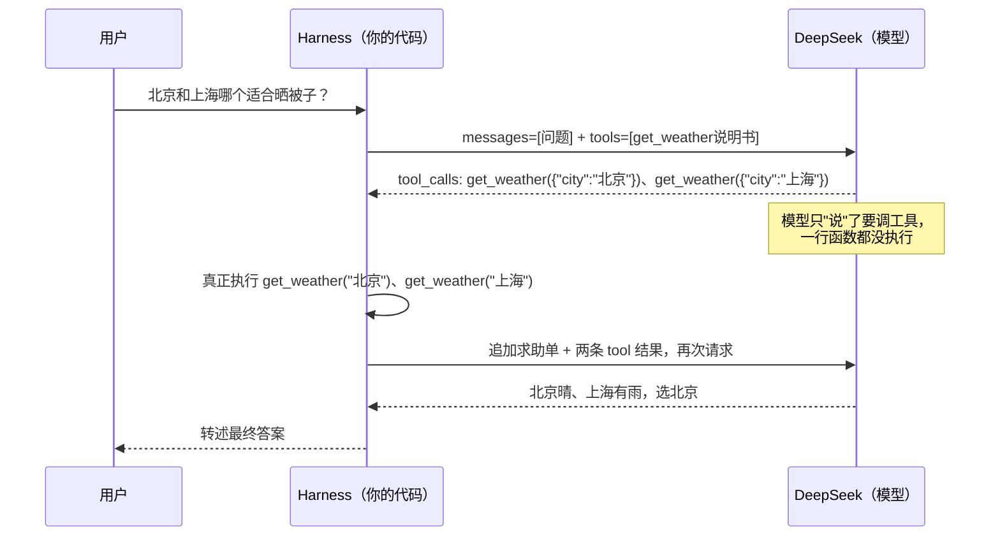

先说一个反直觉的事实：你每次调用 DeepSeek API 的那一两秒里，模型其实什么都没"做"。它不查网、不跑代码、不看表，甚至不知道今天是几号。它自始至终只干一件事——**收到一段文本，续写下一段文本**。

可是同样"只会续写文本"的模型，放进 Claude Code 这类工具里，就能改你的代码库、跑你的测试、提交你的 commit。模型没换量级，多出来的本事从哪来的？

答案在模型外面那层东西，圈子里的黑话叫 **harness**——直译是"马具"。本篇干两件事：把这个概念拆开讲透，然后真的动手，用 60 行 Python 给 DeepSeek 拼一副最小但完整的马具。

## L1：先用起来——裸模型的一问三不知

你现在在第一层：先让东西跑起来，感受问题长什么样。

调用 DeepSeek 的裸 API 只要十来行。它的接口与 OpenAI 完全兼容，装好 `openai` 这个 SDK、把 `base_url` 一换就能用：

```python
# bare.py —— 裸调用：没有 harness，只有模型
import os
from openai import OpenAI

client = OpenAI(
    api_key=os.environ["DEEPSEEK_API_KEY"],
    base_url="https://api.deepseek.com",
)
resp = client.chat.completions.create(
    model="deepseek-chat",
    messages=[{"role": "user", "content": "北京和上海哪个更适合今天晒被子？"}],
)
print(resp.choices[0].message.content)
```

运行之前先做个预测：**这段代码会输出什么？**尤其是"今天"这两个字，模型打算怎么处理？

跑一下，典型回复是这样：

```text
抱歉，我无法获取实时天气信息，建议您查看天气预报……
```

模型不是谦虚，它是真没有。它没有可以伸出去查天气的手，没有跑代码的执行环境，连一块表都没有——训练数据截止日之后的世界，对它来说等于不存在。你当然可以换种问法、写更聪明的提示词，但那只是让道歉写得更委婉，**缺的不是一个更好的提示词，是一双手**。

顺带一个文档冷知识：`base_url` 写成 `https://api.deepseek.com/v1` 也行，DeepSeek 官方文档特意强调这个 `/v1` 与模型版本毫无关系，纯粹是为了对齐 OpenAI SDK 的路径习惯。从一个 URL 细节就能看出：它押的正是"兼容 OpenAI 生态"这条路，后面会看到这有多关键。

到这里你已经会用裸 API 了。但这解释不了一件事：DeepSeek 的文档里明明写着支持 **function calling**（工具调用）——一个"只会续写文本"的东西，怎么就"会调函数"了？

## L2：拆开看——模型只是开单，跑腿的全是你

第二层，拆协议。

先戳破窗户纸：**function calling 里，模型从来没有执行过任何函数**。模型做的仍然是它唯一会的事——续写文本，只不过这次续写的内容是一段格式约定好的 JSON，意思是"我想请你帮我调一下这个函数，参数在这"。真正去执行函数的，永远是模型外面的**你的代码**。

所以"让 DeepSeek 会查天气"实际上是搭一个三方结构：

- **工具说明书**（你写给模型看的）：有哪些函数、各自干嘛、参数是什么——放在请求的 `tools` 字段里；
- **模型的求助单**（模型续写出来的）：一段 JSON，说"我要调 `get_weather`，参数 `city=北京`"——在响应的 `tool_calls` 字段里；
- **跑腿的循环**（你的代码）：收到求助单 → 真的执行函数 → 把结果作为新消息追加回去 → 带着结果再请求一次模型，直到模型不再求助、直接给出最终回答。

把这个循环画成时序图，注意箭头两端的角色分工：



看这张图时注意一点：模型和外界（你的电脑、天气 API、文件系统）之间**没有任何直接连线**，所有箭头都经过中间那道 harness。这个结构不是工程偷懒，是刻意设计——为什么非这样设计，L3 再谈。

现在把整副马具写出来。工具就用刚才的 `get_weather`，数据用假的，重点在结构不在天气：

```python
# harness.py —— 最小但完整的 agent harness
import json
import os

from openai import OpenAI

client = OpenAI(
    api_key=os.environ["DEEPSEEK_API_KEY"],
    base_url="https://api.deepseek.com",
)

# ① 工具的真实实现：harness 的"手"
def get_weather(city: str) -> str:
    fake = {"北京": "晴，26℃", "上海": "小雨，23℃"}
    return fake.get(city, "查无此城市")

# ② 工具说明书：递给模型的接口面
TOOLS = [{
    "type": "function",
    "function": {
        "name": "get_weather",
        "description": "查询指定城市当前的天气",
        "parameters": {
            "type": "object",
            "properties": {
                "city": {"type": "string", "description": "城市名，如：北京"},
            },
            "required": ["city"],
        },
    },
}]
IMPLEMENTATIONS = {"get_weather": get_weather}

# ③ 循环：harness 的心脏
def run_agent(question: str) -> str:
    messages = [{"role": "user", "content": question}]
    while True:
        resp = client.chat.completions.create(
            model="deepseek-chat",
            messages=messages,
            tools=TOOLS,
        )
        msg = resp.choices[0].message
        if not msg.tool_calls:      # 模型不再求助 = 它认为可以作答了
            return msg.content
        messages.append(msg)        # 求助单本身也要存档
        for call in msg.tool_calls:
            fn = IMPLEMENTATIONS[call.function.name]
            args = json.loads(call.function.arguments)
            print(f"[harness] 执行 {call.function.name}({args})")
            result = fn(**args)
            messages.append({       # ④ 把跑腿结果念给模型听
                "role": "tool",
                "tool_call_id": call.id,
                "content": result,
            })

print(run_agent("北京和上海哪个更适合今天晒被子？"))
```

一次典型运行的输出：

```text
[harness] 执行 get_weather({'city': '北京'})
[harness] 执行 get_weather({'city': '上海'})
今天北京晴、26℃，上海小雨、23℃，晒被子建议选北京。
```

对照 L1 的裸调用：同一个模型、同一个问题，从一句道歉变成了一次真实的查证加一条有依据的结论。模型在这两份代码之间没有发生任何变化——变化的全在模型外面。（模型也可能分两轮逐个城市查询，或最终措辞不同，这都正常；**有变化的是"能拿到答案"，不是"每次走同一条路"**。）

三段历史，帮你看清这层协议的来路。在 OpenAI 于 2023 年 6 月发布 function calling 之前，大家让模型"调工具"的办法是民间偏方：在提示词里求模型按 `Thought/Action` 的格式输出（ReAct 论文把这套提示技巧系统化了），再用正则从模型自由发挥的文本里硬抠出函数名和参数——抠崩溃的人不计其数。function calling 做的事，是**把偏方扶正成协议**：模型经过微调，续写的不再是自由文本而是保证可解析的 JSON。而 DeepSeek 又把整套协议原样兼容过来，于是你上面写的 harness，换 `base_url` 就能对接任何兼容 OpenAI 协议的模型服务——工具说明书、求助单、跑腿循环，三样东西一个字都不用改。

最后留一个"故意写坏"的实验，验证你真的理解了角色分工：把 ④ 那个 `messages.append({...})` 整块注释掉再跑。先预测会发生什么？模型开出了求助单，你执行了，但**没有把结果念回给它听**——下一次请求发过去时，协议里就出现了一张有 `tool_calls` 的消息却没有配对的 `tool` 结果，多数 OpenAI 兼容服务会直接以 4xx 拒掉这次请求。这个报错本身就是一份证词：上下文里每一张单据都要对得上账，这本账，就是 harness 在管。

到这里机制已经拆完了。但还有一层没回答：为什么非得是"模型开单、harness 跑腿"这种分工？把执行权直接交给模型不行吗？

## L3：想得透——harness 到底是什么

第三层，去掉所有术语，回答"这东西本质是什么"。

> **模型是一个只会生成文本的大脑；harness 是给它配的经纪人——替它跑腿、替它记账（messages 这本流水账）、替它把跑腿结果念回给它听。工具表是接口面，执行器是手，循环是心跳，三样凑齐，大脑才有了身体。**

现在能看懂"harness"（马具）这个命名有多准确了：马具不增加马的力气，harness 也丝毫不会增加模型的参数——差的 harness 同样能让好马跑不出来（说明书含糊，模型就不会用你的工具；工具结果一股脑全塞回去，账本太乱，模型会看丢重点）。挽具的价值在于把马力不打滑地传递到犁上，harness 的价值在于把模型的续写能力不打折地接到现实世界上。类比在这里失效的地方：马具是静态的皮带，而 harness 的"账本"部分是活的——每一轮都在长，长了以后怎么裁，是门大学问，文末再说。

为什么非得是"模型开单、harness 跑腿"？看两个被否决的替代方案就明白了：

**方案一：执行权交给模型。**模型直接在你机器上跑代码、发网络请求，听起来最快意。失败场景在安全：模型的输出本质是**不可信文本**——它可能一本正经地"决定"删掉一个目录。所以所有严肃的设计都把决定权和执行权切开：模型只有建议权（开单），执行方保留否决权（跑腿前可以检查、询问、拒绝）。Claude Code 每次执行命令前的权限确认，就是这道闸门的可见形态。

**方案二：能力做成产品内置开关。**聊天产品里放一个"联网搜索"按钮、一个"代码解释器"开关，开箱即用。代价是能力面封闭：用户塞不进自家的工具（"查一下我们内部库存系统"这种需求就没辙了），而且什么时候触发工具由产品逻辑接管，不如协议层灵活。内置路线服务大众体验，协议路线服务开发者生态，DeepSeek 选的是后者——它只给协议，马具留给生态自己造。这也是为什么即使有了 Claude Code，依然有大量团队在亲手写 harness：**自家业务的自家工具，只有自己造的马具装得上去**。

想通这一层，文章开头那个问题也有了更锋利的答案：为什么同一个量级的模型，换个 harness 表现天差地别？因为模型每次推理时"看到"的唯一世界，就是上下文窗口里那几千上万个 token——**harness 实际上是在每个回合编写这个世界的全部剧本**：系统提示词写它的人设和能力清单，工具说明书写它能碰的边界，裁剪和压缩决定它记得什么、忘掉什么。Claude Code 强，模型之外的大头正是这门"剧本工程"：上下文快满时怎么压缩、工具输出太长怎么截断、`CLAUDE.md` 和记忆怎么注入。本站[前两篇](/2026/09/05/claude-code-plugins.html)写的插件系统，本质上也是在这副马具上**加挂件**——技能、命令、钩子，全都是在给"剧本"添内容；[插件开发那篇](/2026/09/07/claude-code-plugin-dev.html)动手造的，就是挂件本身。这篇则把马具拆开看了个遍。

## 收尾地图

一张选型速查表：

| 你的需求 | 该用什么 |
|---|---|
| 一次性问答、翻译、总结 | 裸 API（L1 那十来行） |
| 自己的产品要接几个自家工具 | 自写最小 harness（本文 60 行起步） |
| 复杂多步任务、要权限门和上下文压缩 | 现成 agent 框架，或直接读成熟 harness 的源码 |
| 只是想让写代码变快 | 成品（如 Claude Code），别自己造 |

留三个自测问题，能答上来说明真懂了：

1. 模型"调用了" `get_weather`，这个函数最终运行在谁的进程里？模型自始至终产生过什么？（答案在 L2 第一段）
2. 把 `tools=[TOOLS]` 这个参数整个删掉再问同样的问题，输出会和 L1 的裸调用有什么区别？为什么？（提示：说明书都没递过去，模型知道有这回事吗？）
3. 同一个模型，为什么放进 Claude Code 就"能干得多"？用"剧本"两个字组织你的答案。（答案在 L3 最后一段）

最后指个方向，也是下一篇的伏笔：本文的账本 `messages` 只会越攒越长——真实任务里几十轮工具调用之后，上下文窗口必然见底，到时候砍哪段、留哪段、怎么压缩，直接决定 agent 是"越干越聪明"还是"越干越糊涂"。上下文管理是 harness 工程真正的深水区，下篇展开。另外，工具表硬编码在 Python 里显然不体面——"工具的插拔协议"（MCP）是插件系列埋过的另一个伏笔，两篇伏笔，迟早要还。
