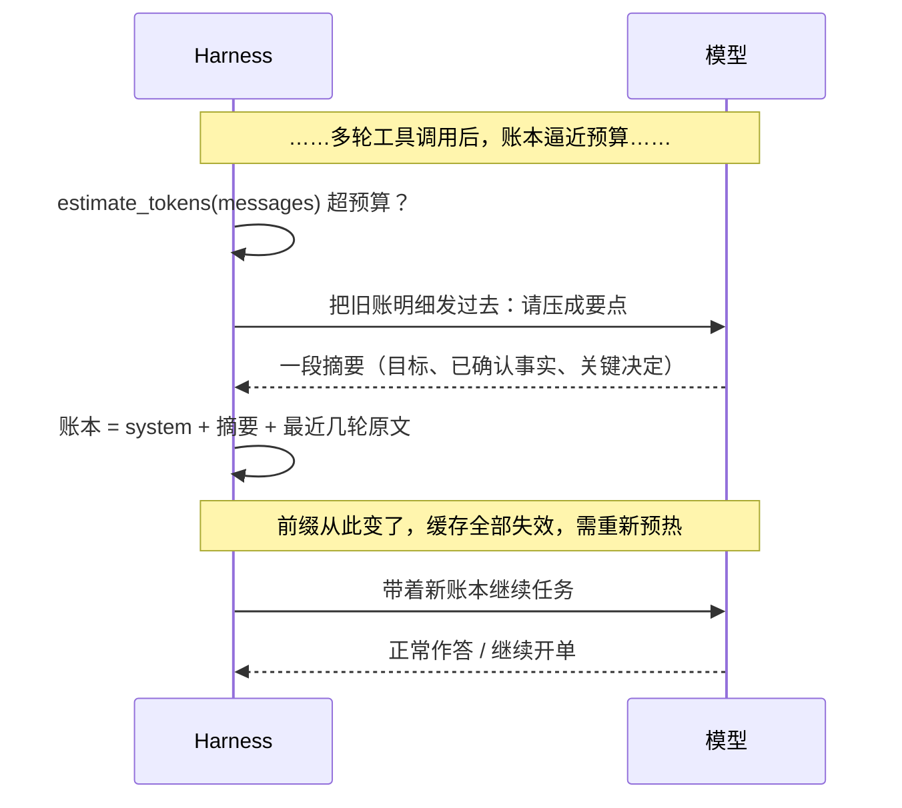

先按一遍计算器。一个跑了 30 轮工具调用的 agent 任务，假设每轮往账本里新增 1000 token（一张求助单加几条工具结果，这个数不夸张，甚至偏保守），那么全部新增内容是 30 × 1000 = 3 万 token。但每次调 API，都得把之前攒下的账整本重发一遍，所以你实际付的输入总量是 1000 + 2000 + … + 30000 = **46.5 万 token**——是新内容的 15.5 倍。（1 + 2 + … + 30 = 465，不信可以自己按。）

这是[上篇](/2026/09/11/deepseek-agent-harness.html)文末埋的伏笔：那 60 行 harness 里的 `messages` 流水账，只会越攒越长。本篇来还这笔债。账本变长的后果还不止是钱：任务越往后，agent 越贵、越慢，还越糊涂——一个干了半小时活儿的 agent，可能已经忘了自己最初要干嘛。这不是玄学，是上下文的结构使然。

照旧分三层：先学会安全地裁账本（L1），再看清算本为什么必然压垮你（L2），最后想透"记性"到底是什么（L3）。本篇所有实验都在本地离线验证过，输出原样照贴。

## L1：先用起来——裁账本，但别裁出事故

你现在在第一层：先让那本越攒越长的账本能安全地瘦下来。

裁之前先会量。token 数不用调接口，粗估就够做预算决策：

```python
def estimate_tokens(messages):
    return len(json.dumps(messages, ensure_ascii=False)) // 2
    # 量级估算：中英混排约 2 字符/token，误差足够小到不影响"裁不裁"的判断
```

真要裁的时候，第一个涌上心头的方案是"砍最旧的"：`messages = messages[2:]`。先做个预测再动手——这样裁，最先出事的会是什么？

回想上篇结尾那个"故意写坏"的实验留下的结论：**协议要求每张求助单（`tool_calls`）后面必须跟着配对的回单（`tool` 消息）**。一个六行的校验器能替你把关：

```python
def check_pairing(messages):
    opened = {c["id"] for m in messages for c in m.get("tool_calls", [])}
    replied = {m["tool_call_id"] for m in messages if m.get("role") == "tool"}
    return opened - replied, replied - opened   # (没回执的单, 没有单的回执)
```

拿上篇那段跑完晒被子问答的账本喂给它，再喂一份砍掉最旧两条的：

```text
完整账本: (set(), set())
朴素截断: (set(), {'c1', 'c2'})
```

完整账本两个集合都是空的，单据全部配平。朴素截断之后，第二个集合里冒出两张孤儿回执——`c1`、`c2` 的求助单被裁掉了。多数 OpenAI 兼容服务会直接以 400 拒掉这种残缺账本。于是有了裁账本的第一条纪律：**按轮裁，不要按条裁**。一轮从一条 `user` 消息开始，到模型的下一次答复为止，是记账的完整单元——裁就整轮进出：

```python
def prune(messages, keep_rounds=6):
    assert messages[0]["role"] == "system"
    rounds = []                      # 把 system 之后的消息切成轮
    for m in messages[1:]:
        if m["role"] == "user":      # 一轮从一条 user 消息开始
            rounds.append([m])
        else:
            rounds[-1].append(m)
    return [messages[0]] + [m for r in rounds[-keep_rounds:] for m in r]
```

在 6 轮账本上验证：31 条裁到 11 条（保留最近 2 轮），`check_pairing` 前后都是配平的，不会出 400。

到这里你已经会让账本瘦身了。但这解释不了一个更尴尬的现象：滑窗裁掉的是旧轮次——**而任务目标往往就在第一轮**。裁到第 20 轮，agent 忘了自己要干嘛，开始原地打转、重复调同一个工具。丢，是丢不掉这个问题的，得换思路。

## L2：拆开看——为什么账本必然压垮你

第二层，拆结构。

先揭一层窗户纸，跟上次"模型只是开单、一行函数都没执行"同样重要：**chat API 是无状态的**。你连调 30 次 API，服务端没有任何一个"它"记得前 29 次——模型每回合看到的世界，就是你这次发过去的 `messages`，一个字不多、一个字不少。所谓它的"记性"，全靠你每次把整本账重新念给它听。这句话是整篇的地基，往下三条恶化的轴全由它而来：

- **钱**：账本整本重发，意味着输入 token 随轮数平方长。n 轮任务、每轮新增 t token，总输入约 t·n(n+1)/2。n=30 放大 15.5 倍，n=60 放大 30.5 倍——账单按平方膨胀，而任务产生的价值顶多线性涨。
- **慢**：每次请求，服务端都要对整本账做一遍预填充（prefill）——把每个 token 的注意力中间结果都算出来，才能开始生成。账越厚，这一遍越慢，而且每一轮都重付。
- **糊**：把 20 万 token 塞进窗口，不等于模型"都看到了"。2023 年的一篇论文《Lost in the Middle》（Liu 等，后刊于 TACL）系统测过这件事：把答案在长文档中的位置从开头挪到结尾，检索准确率大致呈 U 型——**中间的内容最容易被看丢**。对 agent 这是致命的：任务目标在第 1 轮，工具结果堆在第 40 轮，中间隔着十几万 token 的过程记录。

所以成熟 harness 的账本不是一根流水线，而是一个分区结构：

```text
一本会呼吸的账本（自上而下：越靠上越稳定，越靠下越新鲜）

┌─ 驻留区 ── 永不裁剪 ─────────────────────────
│    system 提示词 · 工具说明书
├─ 压缩区 ── 旧明细 → 一条摘要 ─────────────────
│    "[此前对话摘要] 用户要对比两地天气；
│     已确认北京晴26℃、上海小雨23℃；已建议选北京"
├─ 滑动区 ── 最近 K 轮原文，整轮进出 ─────────────
│    user: 追问…… assistant: tool_calls……
│    tool: 结果……  assistant: 答复……
└─ 档案室 ── 根本不占上下文，按需调档 ───────────
     记忆文件 · 检索库：要用哪条，才复制哪条进来
```

看这张图时注意两件事：越往上越稳定（驻留区里的东西一个回合都不能缺席），以及**档案室在窗口外面**——它是唯一不按 token 计费的记忆。四个区对应四门手艺，滑窗你已经会了，看另外三门：

**压缩（compaction）**：治"裁丢任务目标"的病——丢明细、留要点。把旧轮次交给模型自己写成一段摘要，替换原文：

```python
def compact(messages, keep_recent=5, summarize=fake_summarize):
    """新结构 = system 驻留 + 一条摘要 + 最近 keep_recent 条原文。
    切点必须落在轮边界（某条 user 消息的开头），否则又造出孤儿回单。"""
    system, body = messages[0], messages[1:]
    cut = len(body) - keep_recent
    return [system,
            {"role": "user", "content": f"[此前对话摘要]\n{summarize(body[:cut])}"},
            *body[cut:]]
```

离线验证（沿用上篇的天气工具，假装跑完 6 轮）：

```text
压缩前: 31 条消息, 约 1473 token, 配对完整: True
压缩后:  7 条消息, 约  312 token, 配对完整: True
```

账本薄了约八成，配对依旧完整。上线时只需把 `fake_summarize` 换成一次真实的模型调用——把旧账发过去，让它"压缩成要点，保留任务目标、已确认的事实和关键决定，丢弃中间过程"。Claude Code 里手动触发的 `/compact` 命令，干的就是这件事。

**外置记忆**：跨任务、跨会话要记的东西（用户的偏好、项目的背景），写成文件躺在磁盘上，不常驻窗口，每个新会话开头挑相关的几行注入。给这个博客维持写作记忆的 `MEMORY.md`，和上篇提过的 `CLAUDE.md`（后者是驻留区常客），就是这一门的两副面孔。

**缓存**：一只无形的手。多数推理服务都提供提示词缓存——两笔请求的开头若干 token 逐字节相同，服务端就能把上次算好的注意力中间结果（KV 缓存）留下来直接复用，跳过 prefill；缓存命中的输入，价格通常只有正常输入的零头（各家有自动开启的也有要显式标记的，以官方价目为准）。但它带来一条与直觉相悖的工程纪律：**前缀稳定 = 钱**。这跟滑窗天生相克——滑窗裁的恰恰是头部，每裁一次，前缀全断，缓存从头再来。实战的调和办法是把裁剪攒着做：平时只追加不改写（append-only），让前缀一直命中；账本见底时才做一次 compaction——付一次缓存全失效的代价，换一本薄了八成的账继续稳定命中。这正是"压缩要攒到临界点才触发"的另一半理由。压缩那一轮的完整时序：



看这张图时注意那行灰色的注脚：压缩生效的那一轮，恰恰是缓存被清零的一轮——省 token 和保缓存在这一个回合里是直接冲突的，权衡的本质是"付一次大代价，换之后每一轮的小代价"。

手段凑齐了：驻留、滑窗、压缩、外置、缓存。但为什么说这是深水区，而不是一张可以照抄的待办清单？因为这些手段全在争夺同一本账的同一页纸——摘要写多长、原文留几轮、什么进档案室，没有一次性的正确答案，每个回合都在重新权衡。而所有权衡背后其实是同一个问题：模型的"记性"，到底存放在哪？

## L3：想得透——记性是租的

第三层，去掉所有术语：

> **模型的记性不存放在它脑子里，存放在你每回合重新递过去的那张纸上。上下文管理因此是一门遗忘工程：替一个没有遗忘能力的大脑，决定什么驻留、什么缩写、什么归档、什么丢弃。**

现在能读懂标题里"租"字的分量了：**窗口是租的，不是买的**。把上下文窗口从十几万 token 扩到上百万，月租涨上去，但每一页照样按页付费、按页重读、按页稀释注意力——这就是为什么窗口变大没有终结这个话题，只是把危机往后推。看清这一点，三条"显然的替代方案"就都不成立了：

**方案一：把窗口造大。**如上，重读成本、注意力稀释（U 型曲线只是被拉长，不会消失）一样不少。治标，连标都治不彻底。

**方案二：服务端做有状态。**让服务器记住这个会话，下次接着聊，不就什么都不用发了？代价在根基：无状态意味着任意一台机器能接任意一个请求，这是推理服务横向扩展的前提。业界的折中正是提示词缓存——把"记忆"降格成"前缀逐字节不变才命中的 KV 值缓存"。注意它把协议成本转嫁给了谁：**为了保证前缀稳定，harness 只能 append-only、不能随手裁头——写马具的人被缓存协议反向塑造了写法**。这呼应上篇的结论：harness 与模型是共同进化的。

**方案三：什么都放检索（RAG）。**全部内容存外部库，每回合按需检索注入，窗口永远清爽。失败场景在工作记忆："三分钟前刚定的那个函数名叫 `run_checks`"——这种东西放检索库里，召回它本身又得先猜对关键词；而且检索出来的内容照样占上下文，只是把"什么都带着"换成了"带错的可能"。检索管长期知识，管不了正在干活的手头那本账。

最后送一个类比，连同它的失效边界。人脑在睡眠里做记忆巩固：海马体把白天的细节压成要点，写进皮层长期存储，细节逐渐模糊。compaction 与它惊人地同构——所以压缩要像睡眠一样，攒够一轮再集中做一次，而不是每五分钟眯一眼。但类比失效的地方才是重点：**人的回忆是免费的、按需的、想起来才想；agent 的"想起来"是每回合全量重读、按 token 付费**。人不需要每五分钟把毕生所学从头读一遍，agent 需要。上下文管理这门工程之所以存在，就存在这条缝上。

上篇说，harness 是在给模型"编写剧本"。上下文管理就是剧本的删改权：同一个模型，马具好坏的分野，很大程度不在工具多少，而在这本账每一页的去留。开头那句"越干越聪明还是越干越糊涂"，答案现在清楚了——取决于替它管账的那个人。

## 收尾地图

一张处境速查表：

| 你的处境 | 先试什么 |
|---|---|
| 对话几轮就结束 | 什么都不做——这是大多数场景，别过度工程 |
| 多轮任务，账本逼近窗口或预算 | 按轮滑窗（L1），绝不按条裁 |
| 滑窗把任务目标都裁丢了 | 压缩 compaction（L2），目标、事实、决定进摘要 |
| 要跨任务、跨会话记住东西 | 外置记忆文件，每回合按需注入 |
| 账单或延迟随轮数暴涨 | 检查前缀稳定性吃缓存红利；裁剪攒到临界点一次做 |
| 模型总"看不到"关键信息 | 先减量（上面几条），再把要点挪到账本头部或重复提及 |

留三个自测问题，能答上来说明真懂了：

1. 30 轮、每轮新增 1000 token 的任务，总输入是多少？60 轮呢？放大倍数随轮数怎么变？（答案在本文第一段和 L2，请按计算器验证）
2. 为什么按条滑窗必然出 400、按轮滑窗不会？用"单据配对"组织你的答案。（答案在 L1）
3. 缓存和滑窗为什么相克？实战里怎么调和，调和方案里 compaction 的触发时机藏着什么权衡？（答案在 L2 末段）

最后指个方向，也是下一篇的伏笔：回看那张分区图——工具说明书住在驻留区里，一个回合都不能缺席。工具一多，光说明书就能吃掉几千 token，而且从进会话起就常驻不走。"按需把说明书递给模型"，正是 MCP（Model Context Protocol，名字里就带着 Context）要解决的问题。它同时是插件系列埋下的另一笔债——两条线，下一篇合流再还。
